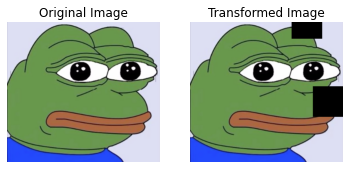
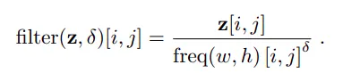
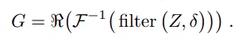
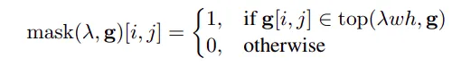
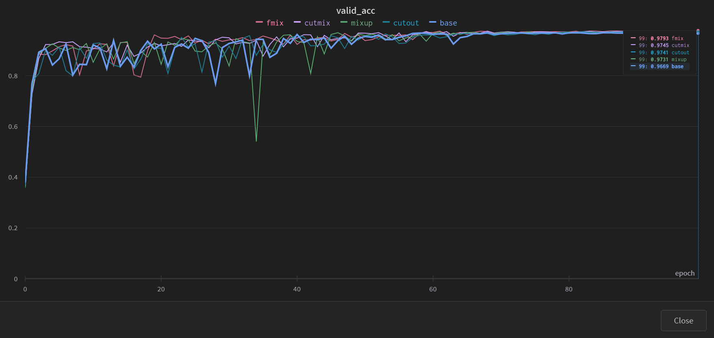

# Pytorch Lightning: Compare Cutout, Mixup, Cutmix, Fmix with Paddy Disease Classification

# Overall about Cutout, Mixup, Cutmix, Fmix

##  Cutout

**Link :** [Improved Regularization of Convolutional Neural Networks with Cutout](https://arxiv.org/abs/1708.04552)



**Cutout** is an augmentation technique that randomly covers a region of an input image with a square.  

Strengths:

- **Cutout** helps in training models to recognize partial or occuluded objects
- **Cutout** allows the model to consider more of the image context such as minor features rather than relying heavily on major features before making a decision

Weaknesses:

- **Cutout** can remove important features, especially in sparse images

##  Mixup

**Link :** [mixup: Beyond Empirical Risk Minimization](https://arxiv.org/abs/1710.09412)


The core idea behind Mixup image augmentation is to mix a random pair of input images and their labels during training.

Mixup can prevent overfitting by creating more diverse training samples and thus forcing the model to learn more generalizable features invariant to small changes in the images.

Strengths:

- Relatively easy to implement
- Increases diversity in the training data

Weaknesses:

- Can create blurred images, especially for images with complex textures

```
blended_img = λ*img_a + (1 − λ)*img_b
blended_label = λ*y_a + (1 - λ)*y_b
where λ ∼ Beta(α, α), for α ∈ (0, ∞)
```

##  CutMix

**Link :** [CutMix: Regularization Strategy to Train Strong Classifiers with Localizable Features](https://arxiv.org/abs/1905.04899)


CutMix is a regularization technique for convolutional neural networks. CutMix trains the model using images that are **artificially created** by cutting and pasting parts of two images **together**. The ground truth labels are also **mixed proportionally** to the area of the image that was cut and pasted.

```
x_c = M ⊙ x_a + (1 − M) ⊙ x_b
y_c = λy_a + (1 − λ)y_b
```

where M ∈ {0, 1}W ×H denotes a binary mask indicating
where to drop out and fill in from two images, 1 is a binary
mask filled with ones, and ⊙ denotes an element-wise, λ ∼ Beta(α, α), for α ∈ (0, ∞)

The aspect ratio for mask M is proportional to the original image. The coordinates of bounding box B are uniformly sampled according to

```
rx ~ Unif(0, W), rw = H ∗ √(1 − λ), 

ry ~ Unif(0, H), rh = W ∗ √(1 − λ)
```

the cropped area ratio becomes: rw ∗ rh / (W ∗ H) = (1 − λ)

Strengths:

- Relatively easy to implement (see implementation of Cutmix)
- Increases diversity in the training data

Weaknesses:

- Can create unrealistic images due to unnatural compositions
- Can remove important features, especially in sparse images

##  Fmix

**Link :** [Fmix: Enhancing Mixed Sample Data Augmentation](https://arxiv.org/abs/2002.12047)


In Cutmix, the masks are generated by sampling center coordinates from the uniform distribution while on the other hand, in FMix, binary masks are generated by applying a threshold to low-frequency images sampled from the Fourier space.

A low-pass filter is created by setting δ=3. Z is a complex random variable whose real and imaginary parts are sampled from independent normal distributions.



Inverse Fourier transform of the filter and take only the real part



Set the top proportion to 1



Strengths:

- The main focus of FMix is to improve the masking technique of Cutmix.

Weaknesses:

- Can create unrealistic images due to unnatural compositions
- Can remove important features, especially in sparse images

# Results

Results after 100 epochs (run training.ipynb on colab)



**Data augmnetation methods give better results than base, where fmix and cutmix give the best results**

# References

**Synthesized knowledge from:**

https://towardsdatascience.com/cutout-mixup-and-cutmix-implementing-modern-image-augmentations-in-pytorch-a9d7db3074ad

https://sarthakforwet.medium.com/cutmix-a-new-strategy-for-data-augmentation-bbc1c3d29aab

https://medium.com/@virajbagal12/mixed-sample-data-augmentation-721e65093fcf

https://github.com/facebookresearch/mixup-cifar10/blob/main/train.py

https://www.kaggle.com/code/ar2017/pytorch-efficientnet-train-aug-cutmix-fmix#Cutmix-and-Fmix

https://github.com/ecs-vlc/FMix
